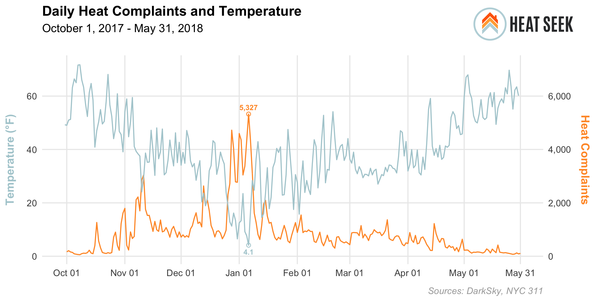

# heatseek-blogs
Data work for HeatSeek blog updates 

---

### Getting Started

Install the following R packages

```r
pkgs <- c("tidyverse", "here", "fs", "sf", "mapdeck", "htmlwidgets", "magick", "DBI", "darksky")
install.packages(pkgs)
```


Edit [`sample_config.R`](sample_config.R) to add you connection info for [nyc-db](https://github.com/aepyornis/nyc-db), your [MapBox](https://www.mapbox.com/signup) API key, and your [DarkSky](https://darksky.net/dev/register) API key.

---

#### [`season-heat-complaints_barchart.R`](season-heat-complaints_barchart.R)


---

#### [`temperature-complaints_linechart.R`](temperature-complaints_linechart.R)


---

#### [`boro-complaints-violations_barchart.R`](heat-complaints-buildings_map.R)


---

#### [`heat-complaints-stats.Rmd`](heat-complaints-stats.Rmd)


---