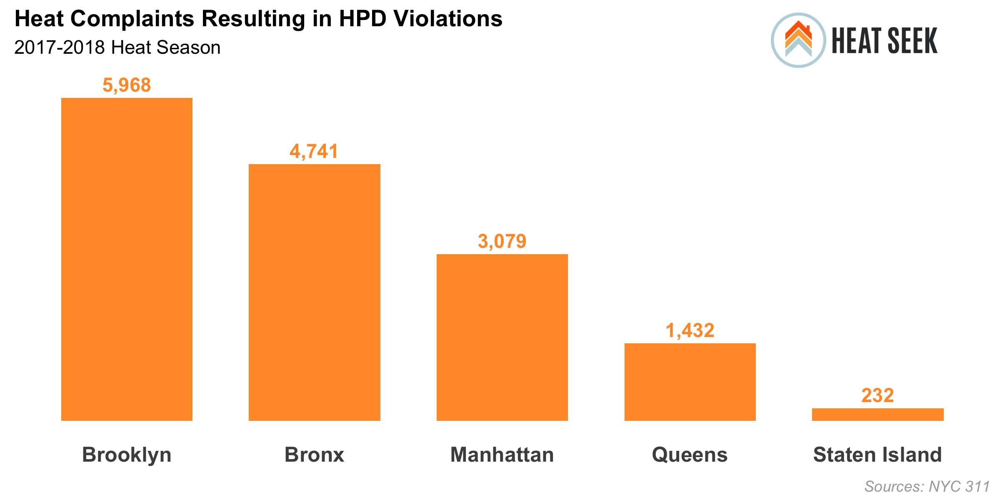

Data work for blog updates on 2017-2018 heat season

---

### Getting Started

<br>

Install the following R packages

```r
pkgs <- c("tidyverse", "here", "fs", "sf", "mapdeck", "htmlwidgets", "magick", "DBI", "darksky")
install.packages(pkgs)
```

Edit [`sample_config.R`](sample_config.R) to add you connection info for [nyc-db](https://github.com/aepyornis/nyc-db), your [MapBox](https://www.mapbox.com/signup) API key, and your [DarkSky](https://darksky.net/dev/register) API key.

---

### Data

<br>

All of the [`data`](data) created for this analysis are available for download, along with [`data dictionaries`](data/data-dictionaries). Included in the folder are a collection of geojson files with heat complaints, heat violations, residential units, and properties aggregated to a varity of geographic levels.

---

### Results

<br>

#### [`season-heat-complaints_barchart.R`](season-heat-complaints_barchart.R)


---

#### [`temperature-complaints_linechart.R`](temperature-complaints_linechart.R)


---

#### [`heat-complaints-stats.Rmd`](heat-complaints-stats.md)


---

#### [`heat-complaints-buildings_map.R`](heat-complaints-buildings_map.R)

